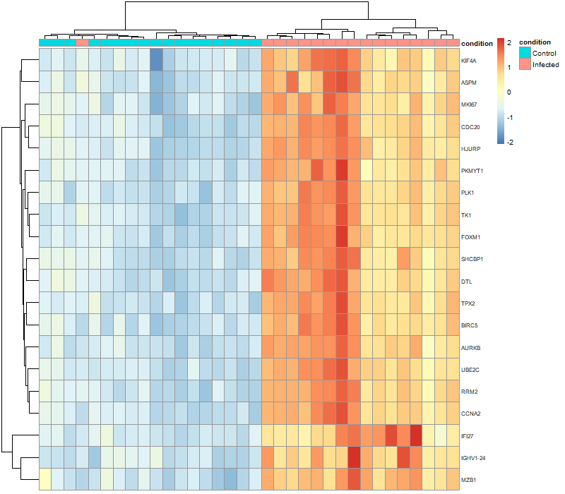
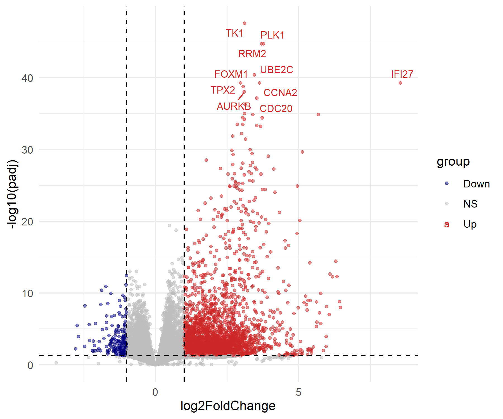
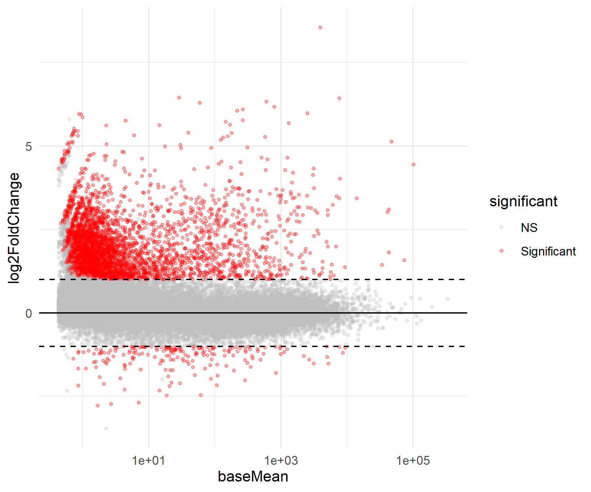
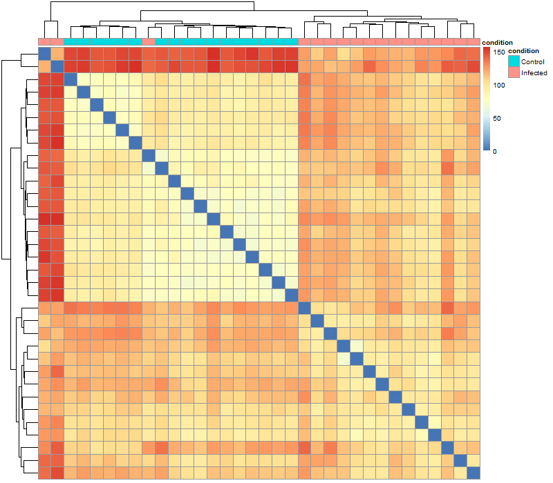
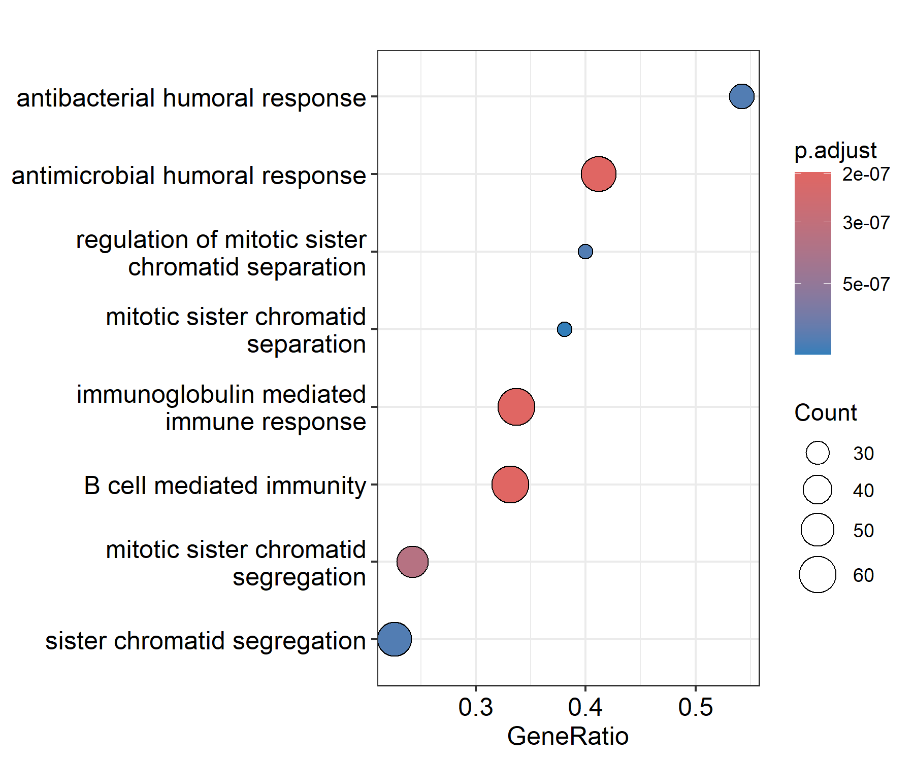
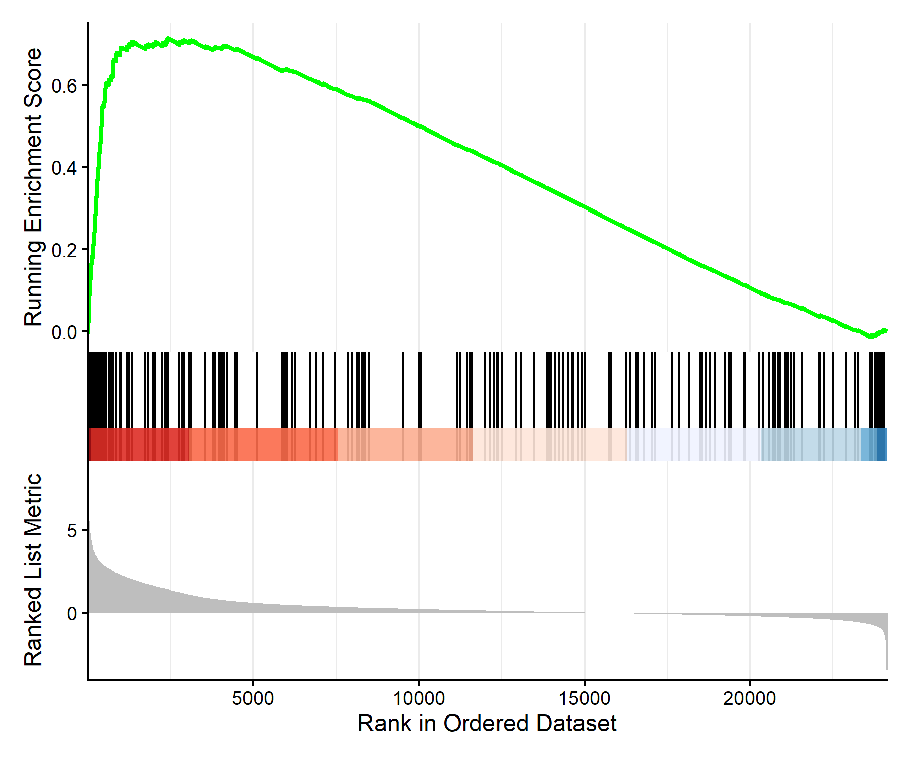

# RNA-seq Analysis of SARS-CoV-2 Infection

# RNA-seq Analysis of SARS-CoV-2 Infection

## Key Findings

SARS-CoV-2 infection induces a strong transcriptional response characterised by:

- Upregulation of immune-related pathways (B cell and humoral immunity)
- Increased expression of cell cycle-associated genes (e.g., TK1, PLK1, CCNA2)
- Clear separation between infected and control samples in PCA

These results suggest coordinated immune activation alongside cell proliferation or cellular dysregulation.

## Overview
This project performs differential gene expression analysis of SARS-CoV-2 infection using bulk RNA-seq data. The aim was to identify significantly altered genes and associated biological pathways.

## Dataset

The dataset used in this analysis is publicly available from the Gene Expression Omnibus (GEO):

Accession: GSE152418

Data can be accessed at:
https://www.ncbi.nlm.nih.gov/geo/query/acc.cgi?acc=GSE152418

## Methods
- Differential expression analysis: DESeq2
- Log fold change shrinkage: apeglm
- Visualisation: PCA, volcano plot, MA plot, heatmap
- Functional enrichment: Gene Set Enrichment Analysis (GSEA) using clusterProfiler

## Key Results
- 6393 genes upregulated and 2869 downregulated (padj < 0.05)
- Strong separation between infected and control samples in PCA
- Enrichment of immune-related pathways (B cell, humoral response)
- Upregulation of cell cycle-associated genes (e.g., TK1, PLK1, CCNA2)

## Visualisations

### PCA

### Volcano Plot

### MA Plot

### Heatmap

### Sample Distance Heatmap

### GSEA Dotplot

### GSEA Enrichment Curve

## Processed Data

Processed results from the analysis are available in the `data/` directory:

- Top differentially expressed genes (`top_100_DEGs.csv`)
- Full list of significant DEGs
- GSEA enrichment results
- Sample metadata

## Key Findings
SARS-CoV-2 infection induces a coordinated transcriptional response characterised by:
- Immune system activation
- Increased expression of cell cycle-related genes

## Limitations
Sample conditions were inferred from sample names due to lack of explicit metadata, which may introduce classification bias.

## Future Work
- Single-cell RNA-seq analysis to resolve cell-type-specific effects
- Integration with proteomics or metabolomics data
- Machine learning approaches for biomarker discovery

## Reproducibility

To reproduce this analysis:

1. Download the dataset from GEO (GSE152418)
2. Run the R script in the `analysis/` folder
3. Outputs will be generated in the `results/` and `data/` directories

## Author
James Hughes
