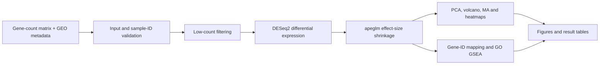

# Bulk RNA-seq analysis of SARS-CoV-2 PBMC samples

A compact bulk RNA-seq analysis of the GSE152418 PBMC dataset, focused on differential expression and pathway-level interpretation.

The analysis uses the original 34 libraries: 17 controls and 17 libraries carrying the historical `Infected` label. The infected group contains 16 acute COVID-19 libraries and one convalescent library, and repeat-draw identifiers are present. The condition-only DESeq2 model is therefore treated as an exploratory reproduction rather than a donor-independent disease-effect analysis.

[Analysis notebook](analysis/bulk_analysis.Rmd) · [Portfolio report](outputs/bulk_analysis.html) · [Figures](outputs/figures) · [Result tables](outputs/tables)

## Key results

- 3,879 significant genes at adjusted p-value < 0.05 and |shrunken log2 fold change| > 1
- 3,688 genes higher and 191 lower in the historical `Infected` group
- PCA, differential-expression visualisation, heatmaps and GO Biological Process GSEA are included
- results are exploratory because repeat sampling and one convalescent library prevent a clean donor-independent acute-infection contrast

## Selected figures

### PCA


### Differential expression


### GO Biological Process enrichment


## Workflow



## Selected outputs

- [Full DESeq2 results with gene symbols](outputs/tables/all_DESeq2_results_with_symbols.csv)
- [Significant differentially expressed genes](outputs/tables/all_significant_DEGs.csv)
- [Top 100 differentially expressed genes](outputs/tables/top_100_DEGs.csv)
- [GO GSEA results](outputs/tables/gsea_results.csv)

## Repository structure

- `data/` — gene-count matrix and GEO-derived sample metadata
- `analysis/` — complete R Markdown workflow
- `outputs/` — figures, result tables and a compact HTML report
- `README.md` — project overview and reproduction instructions

## Analysis workflow

The workflow performs input and sample-ID validation, low-count filtering, DESeq2 differential expression, apeglm log2-fold-change shrinkage, PCA, volcano and MA plots, expression and sample-distance heatmaps, GO Biological Process gene-set enrichment analysis, and export of differential-expression and enrichment results.

## Run

Use R 4.5.2 or a compatible recent R installation with these packages available:

`DESeq2`, `apeglm`, `ggplot2`, `ggrepel`, `pheatmap`, `clusterProfiler`, `enrichplot`, `org.Hs.eg.db`, `AnnotationDbi`, `dplyr`, `readr`, `tibble`, `tidyr`, `BiocParallel`, `rmarkdown`, and `knitr`.

From the repository root:

```sh
Rscript -e "rmarkdown::render('analysis/bulk_analysis.Rmd', output_dir='outputs')"
```

The notebook writes generated tables to `outputs/tables/`, figures to `outputs/figures/`, and the rendered computational report to `outputs/`.

## Data and source study

The count matrix is derived from GSE152418 and contains gene-level counts rather than FASTQ reads. Metadata are retained from GEO and matched exactly to normalized count-column identifiers before analysis.

GEO: https://www.ncbi.nlm.nih.gov/geo/query/acc.cgi?acc=GSE152418

Original study:

Arunachalam PS et al. *Systems biological assessment of immunity to mild versus severe COVID-19 infection in humans.* Science. 2020;369(6508):1210-1220. doi:10.1126/science.abc6261. PMID: 32788292.

## Technical skills demonstrated

R, Bioconductor, DESeq2, apeglm, bulk RNA-seq analysis, differential expression, PCA, gene-set enrichment analysis, gene-identifier mapping, data visualisation, statistical interpretation, and reproducible R Markdown workflows.

## Limitations

The cohort mixes acute infection and convalescence, and repeat-draw identifiers mean donor independence is unresolved. Severity, sex, timing, and other covariates are not modelled in this reproduction. Bulk PBMC expression also cannot distinguish changes in cell composition from within-cell transcriptional regulation. Results should therefore be interpreted as exploratory expression associations under the specified model, not causal or cell-intrinsic effects.

Author: James Hughes
